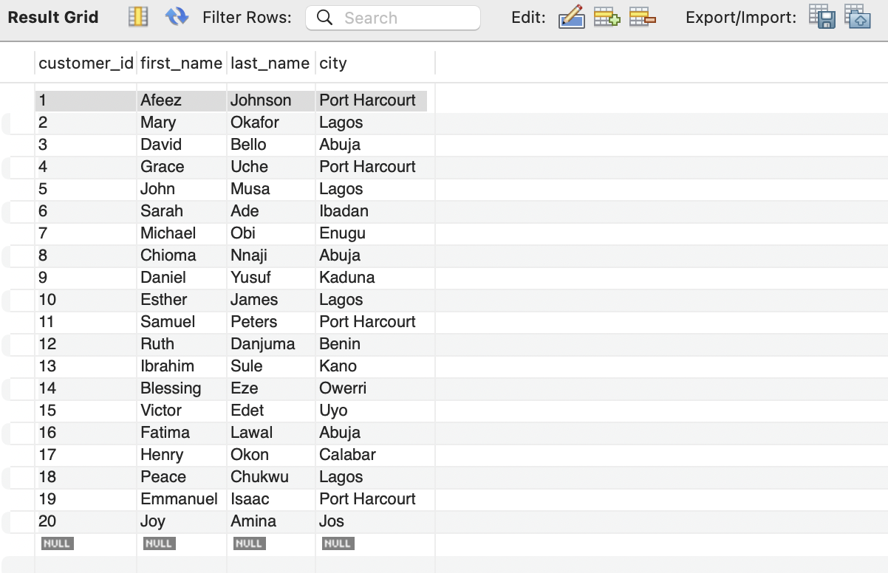

# Supermarket-sales-sql-project
SQL analytics project using MySQL
Supermarket Sales Analytics SQL Project

Project Overview

This project is a relational database and analytics system built using MySQL. The goal of the project is to simulate a real-world supermarket sales environment and perform business analysis using SQL.

The project demonstrates:

* Relational database design
* Data normalization
* Primary and foreign keys
* SQL joins
* Aggregation queries
* Revenue analysis
* Customer analysis
* Product performance analysis
* Dashboard-ready SQL queries

This project can serve as a beginner-to-intermediate portfolio project for:

* Data Analytics
* Business Intelligence
* SQL Development
* Data Science preparation

⸻

Tools Used

* MySQL
* MySQL Workbench
* SQL

⸻

Database Structure

The database contains three tables:

1. Customers images/ 
2. Products
3. Sales

The tables are connected using foreign keys.

⸻

Database Schema

Customers Table

CREATE TABLE Customers(
    customer_id INT AUTO_INCREMENT,
    first_name VARCHAR(50) NOT NULL,
    last_name VARCHAR(50) NOT NULL,
    city VARCHAR(50),
    PRIMARY KEY (customer_id)
);

⸻

Products Table

CREATE TABLE Products(
    product_id INT AUTO_INCREMENT,
    product_name VARCHAR(50) NOT NULL,
    Category VARCHAR(50) NOT NULL,
    Unit_price DECIMAL(10,2),
    PRIMARY KEY (product_id)
);

⸻

Sales Table

CREATE TABLE Sales(
    sales_id INT AUTO_INCREMENT,
    customer_id INT NOT NULL,
    product_id INT NOT NULL,
    Quantity INT NOT NULL,
    Payment_method VARCHAR(50) NOT NULL,
    Sales_date DATE,
    PRIMARY KEY (sales_id),
    FOREIGN KEY (customer_id)
        REFERENCES Customers(customer_id),
    FOREIGN KEY (product_id)
        REFERENCES Products(product_id)
);

⸻

Sample Analytical Queries

1. View All Sales Records

SELECT *
FROM Sales;

⸻

2. Customer Purchase Report

SELECT
    c.first_name,
    c.last_name,
    p.product_name,
    s.Quantity,
    s.Sales_date
FROM Sales s
JOIN Customers c
    ON s.customer_id = c.customer_id
JOIN Products p
    ON s.product_id = p.product_id;

⸻

3. Total Revenue

SELECT
    SUM(s.Quantity * p.Unit_price) AS total_revenue
FROM Sales s
JOIN Products p
    ON s.product_id = p.product_id;

⸻

4. Revenue by City

SELECT
    c.city,
    SUM(s.Quantity * p.Unit_price) AS revenue
FROM Sales s
JOIN Customers c
    ON s.customer_id = c.customer_id
JOIN Products p
    ON s.product_id = p.product_id
GROUP BY c.city
ORDER BY revenue DESC;

⸻

5. Best Selling Products

SELECT
    p.product_name,
    SUM(s.Quantity) AS total_units_sold
FROM Sales s
JOIN Products p
    ON s.product_id = p.product_id
GROUP BY p.product_name
ORDER BY total_units_sold DESC;

⸻

6. Top Customers

SELECT
    c.first_name,
    c.last_name,
    SUM(s.Quantity * p.Unit_price) AS total_spent
FROM Sales s
JOIN Customers c
    ON s.customer_id = c.customer_id
JOIN Products p
    ON s.product_id = p.product_id
GROUP BY c.customer_id
ORDER BY total_spent DESC;

⸻

7. Revenue by Product Category

SELECT
    p.Category,
    SUM(s.Quantity * p.Unit_price) AS revenue
FROM Sales s
JOIN Products p
    ON s.product_id = p.product_id
GROUP BY p.Category
ORDER BY revenue DESC;

⸻

Key Concepts Demonstrated

This project demonstrates:

* Database normalization
* Primary keys
* Foreign keys
* Relational database design
* INNER JOIN operations
* Aggregate functions
* GROUP BY
* ORDER BY
* Revenue calculations
* Business intelligence querying

⸻

Business Questions Answered

The project answers several business questions:

* Which city generates the highest revenue?
* Which products sell the most?
* Who are the top customers?
* Which product categories perform best?
* What payment methods are most used?
* What is the total supermarket revenue?

⸻

Possible Future Improvements

Future upgrades could include:

* Inventory table
* Employee table
* Branch table
* Profit margin calculations
* Monthly sales trend analysis
* Customer segmentation
* Power BI dashboard integration
* CSV data import automation

⸻

Skills Demonstrated

* SQL Querying
* Data Modeling
* Data Cleaning
* Relational Database Management
* Business Analytics
* Reporting
* Analytical Thinking

⸻

Author

Afeez

Aspiring Data Analyst / Data Scientist
